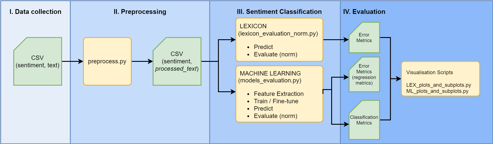
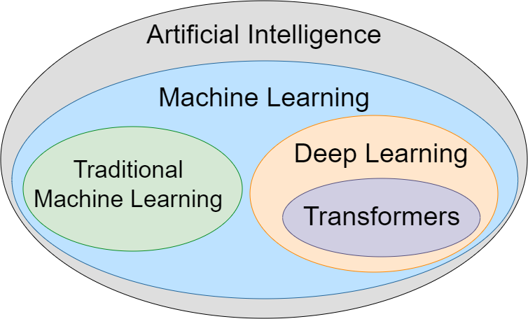
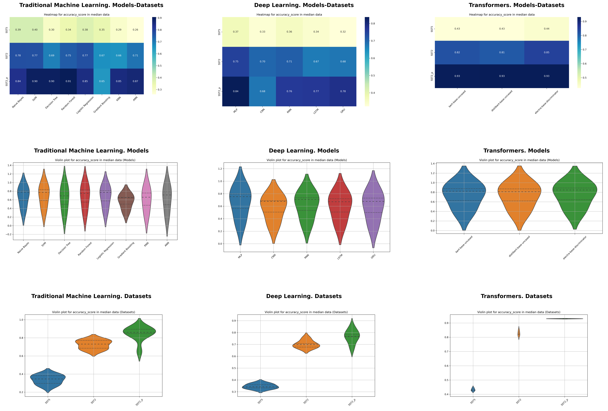

# Execution Steps
**1. Setting up the Python 3.10 environment:** Run `pip install -r requirements.txt` to install all required packages.

**2. Initialization**
   - Download word embedding files and place them in `/input_data/glove_embeddings`.
   - Download lexicon files and place them in `/lexicon_files/`.
   - Insert the dataset ('sentiment', 'text') `data.csv` into `/datasets/raw`. After preprocessing, relocate `data-processed.csv` to `/datasets/processed`.

**3. Evaluation Process**
   - For machine learning analysis:
     - **3.1.** Adjust `config_ml.json` as necessary.
     - **3.2.** Execute `models_evaluation.py`.
     - **3.3.** A folder will appear in `/experiment_outputs/exp_ID1`.
   - For lexicon-based analysis:
     - **3.4.** Adjust `config_lex.json` accordingly.
     - **3.5.** Execute `lexicon_evaluation_norm.py`.

**4. Post-processing Steps**
   - To standardize machine learning regression metrics, place the metrics folder in `/post_processing/machine_learning_data/metrics_ml` and run `normalize_continuous_metrics.py`.

**5. Visualization Execution**
   - For machine learning visualizations:
     - Ensure the metrics are located in `/post_processing/machine_learning_data/metrics_ml`.
     - Execute either `ML_plots_and_subplots.py` or `ML_subplots_violin_mean_median.py`.
   - For lexicon visualizations:
     - Ensure the metrics are positioned in `/post_processing/lexicon_data/metrics_lex`.
     - Run `LEX_plots_and_subplots.py`.

# End-to-end Sentiment Analysis Process

# Complete List of Methods

<<<<<<< Updated upstream
# Lexicon Methods 
=======
## Lexicon methods 
>>>>>>> Stashed changes
  - AFINN
  - WordNet (TextBlob, Pattern, SentiWordNet)
  - SenticNet
  - VADER
  - General Inquirer
  - MPQA
  - OpinionFinder

<<<<<<< Updated upstream
# Machine Learning Methods
=======
## Machine Learning
>>>>>>> Stashed changes

<<<<<<< Updated upstream
## Traditional Methods
=======
### Traditional methods
>>>>>>> Stashed changes
  - Naive Bayes
  - Support Vector Machines (SVM)
  - Decision Trees
  - Random Forest
  - Logistic Regression / Linear Regression
  - Gradient Boosting Machines (GBMs)
  - K-Nearest Neighbours (KNN)
  - Artificial Neural Networks (ANN)

<<<<<<< Updated upstream
## Deep Learning Methods
=======
### Deep learning methods
>>>>>>> Stashed changes
  - Multilayer Perceptron (MLP)
  - Convolutional Neural Networks (CNN)
  - Recurrent Neural Networks (RNN)
  - Long Short-Term Memory (LSTM)
  - Gated Recurrent Units (GRU)

<<<<<<< Updated upstream
## Transformer Models 
=======
### Transformer models 
>>>>>>> Stashed changes
  - BERT
  - DistilBERT
  - ELECTRA

# Results on the SST dataset

